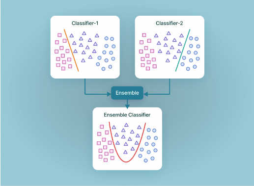
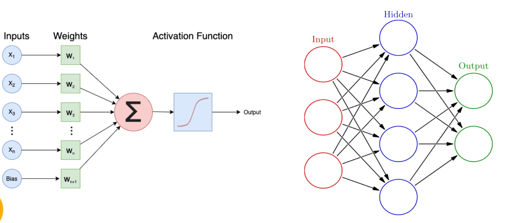
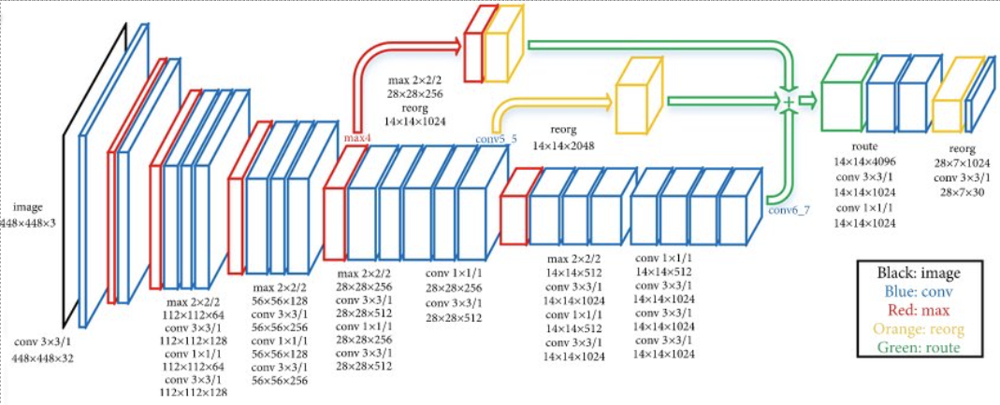
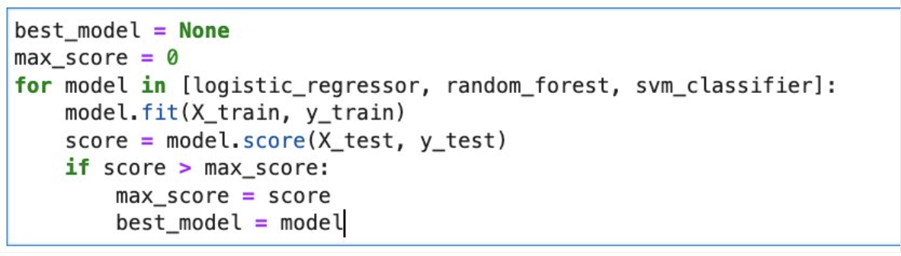
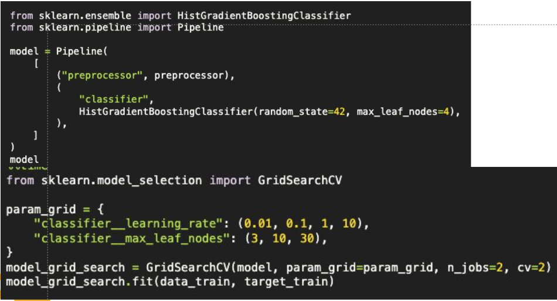
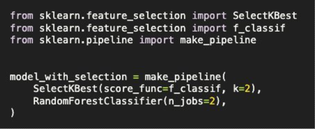
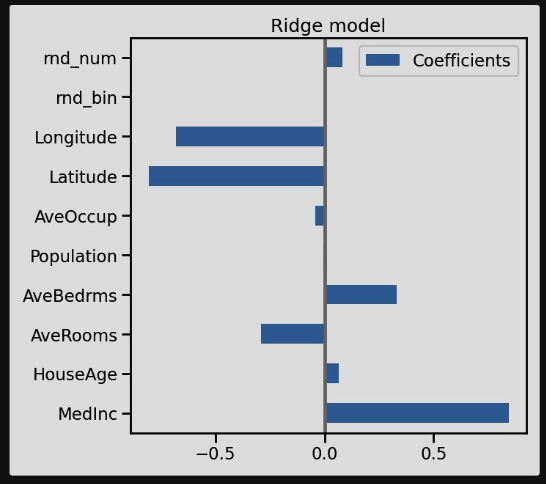
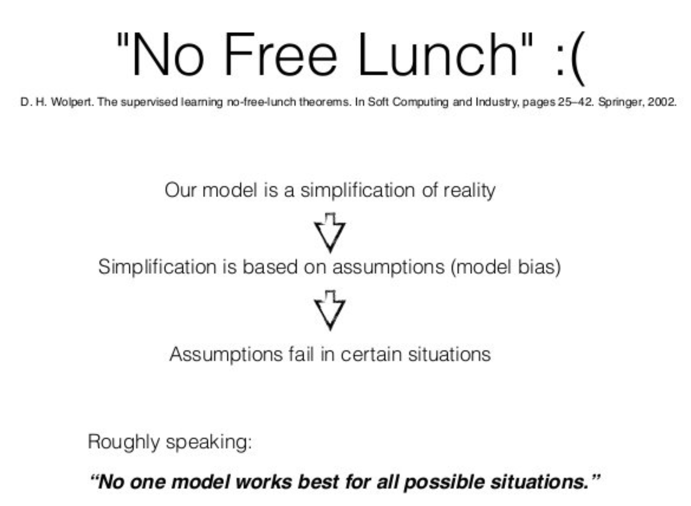

class: center, middle

# Advanced topics: What to try next?

So far this course covered the basics of machine learning. 

This presentation gives an overview of what is out there for you to explore
in the field of machine learning. 

???

We throw a lot of different topics at you, it is up to you to decide 
which you want to pick up.
The sky is the limit! Possible side-effects: You may feel slightly overwhelmed. 
Just take it one step at a time.

---

# Machine learning algorithms
There are many different machine learning algorithms that you can explore.

???
A short recap and further details about different machine learning models

---
# Linear models

???

Linear models: fit a straight line through the data that minimizes the prediction error.

---

# Decision trees

???

Decision trees: Decision trees make decisions by asking a series of questions and choosing the best path based on the answers.
The 'decisions' are based on the patterns in the data.

---

# Support Vector Machines (SVMs)

???

SVM finds the best way to separate different classes in data by creating a clear gap between them.

---

# Ensemble learning

???

Combine different (weak) classifiers by aggregating their individual outputs into one prediction.
Examples are: random forests or gradient boosted decision trees

---

# Neural networks

???

Neural networks consist of artificial neurons: small units that integrate information in a simple, yet adaptable way. 
Through combining a lot of neurons in different layers the neural network can learn patterns in the data.

---

# Deep learning

From https://www.kaggle.com/keras/resnet50

???

In deep learning we use complex neural networks with multiple layers. 
The architecture of the neural network is adapted to specific problems.

---

# Deep learning with fast.ai

???

Fast.ai is a library that is designed to 'make neural networks uncool again'.
It allows you to apply deep learning with a relatively simple syntax,
that is similar to scikit-learn. 
Here you see an example of how to train a relatively complex neural network on the adult census dataset.

---

# Model sweep: pick the best model from a set of models

???

Typically, you do not know which model 'family' works best on your data.
It can help to do a quick 'model sweep': try out a few models to see which works best.

Note that applying models with arbitrary parameters can yield misleading results, especially when you do not understand the underlying algorithm. But trying out a few models with default parameters (which are default for a reason) can quickly give you an idea of what could work well.

---

# Hyperparameter tuning

???

If you have a model that works well on your data, you can still tweak its parameters to create a better fit
or prevent overfitting. You can do that manually, but it is better to use scikit-learn's build-in
hyperparameter tuning functionality.

---

# Automated feature selection

Set of all features --> Feature selection --> Subset of features with highest predictive value --> Train model

???

---

# Explainable machine learning: feature importance

???

There are various methods that can quantify how much different features contribute to the predictions of the model:
feature importance.

---

???

The No Free Lunch theorem in machine learning means that no one algorithm is best for every kind of problem. 
Each algorithm works well for some problems but not for others, so choosing the right one depends on the specific task.

---

# Take it one step at a time
* Train model
* Evaluate model
* Define next steps:
  * Where does the model still make mistakes?
  * What are promising next steps?
  * Focus on: low effort, high impact (**low hanging fruits**)

Repeat

???
